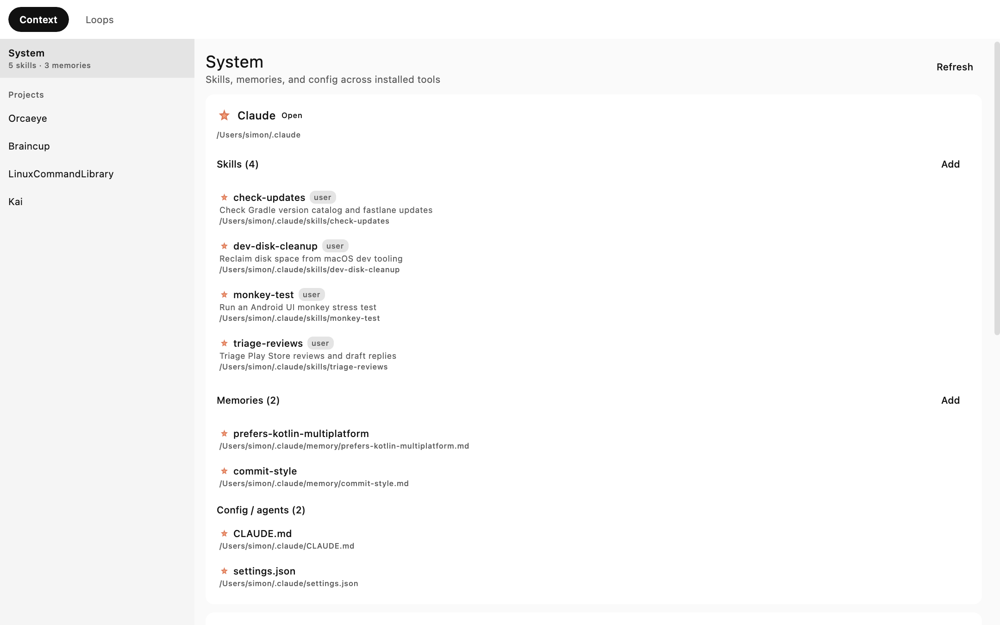
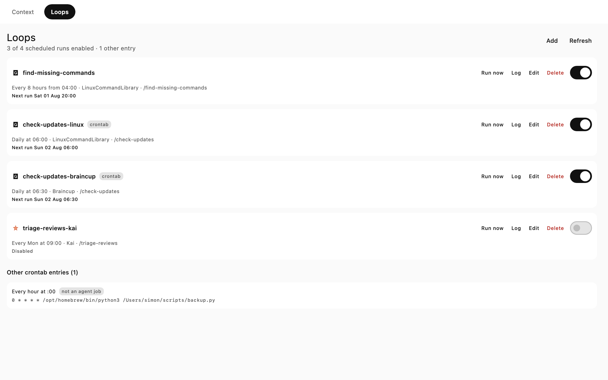
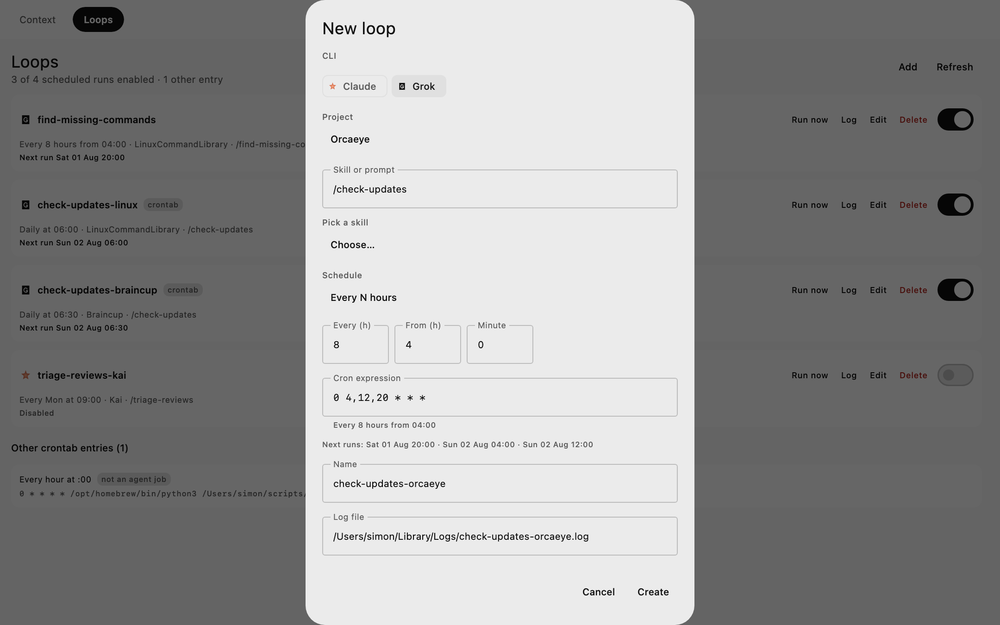

# Orcaeye

Desktop app to manage the skills and memories your agent CLIs use — system-wide
and per project, alongside their agent files and config — and to set up **Loops**:
recurring agent runs scheduled through your system's own cron.

Works with Claude, Grok and OpenCode, on macOS, Windows and Linux.







## Install

```bash
brew install --cask simonschubert/tap/orcaeye
```

MSI, deb, rpm and AppImage builds are attached to each
[release](https://github.com/SimonSchubert/Orcaeye/releases).

## Loops

A loop is a line in your **user crontab**. Pick an interval, a CLI, a project and
a skill or prompt, and Orcaeye writes it:

```
# orcaeye id=a1b2c3d4 name=check-updates-orcaeye
0 4,12,20 * * * cd '…/Orcaeye' && PATH=… grok -p '/check-updates' --always-approve … >> '…/check-updates-orcaeye.log' 2>&1
```

Cron entries you wrote by hand are adopted as editable jobs. Anything that isn't
an agent-CLI call is listed read-only and copied through untouched. Every write
backs the previous crontab up to `~/.orcaeye/crontab-backups/`.

## License

[Apache 2.0](LICENSE). The installers bundle a Java runtime (Temurin) under
GPLv2 with the Classpath Exception.
